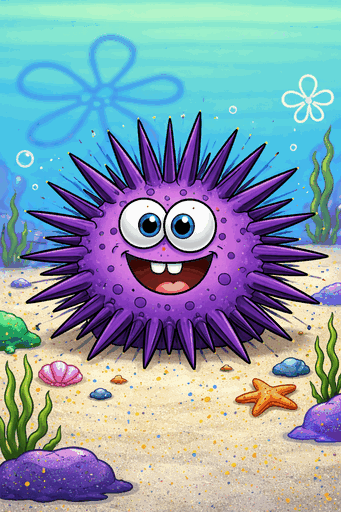

<p align="center">
  
</p>

<h1 align="center">Urchin</h1>

<p align="center">
  <strong>Quantum-encrypted file vault for the command line</strong>
</p>

<p align="center">
  <a href="https://www.npmjs.com/package/urchin-vault"></a>
  <a href="https://github.com/capsule-corp-ternoa/urchin/blob/main/LICENSE"></a>
  
  
</p>

<p align="center">
  Encrypt files with <a href="https://sdk.cifer-security.com/docs/">CIFER</a> (ML-KEM-768 + AES-256-GCM) and store them on <a href="https://storacha.network">Filecoin/IPFS</a> or locally.
</p>

<p align="center">
  <a href="#installation">Installation</a> •
  <a href="#quick-start">Quick Start</a> •
  <a href="#how-it-works">How It Works</a> •
  <a href="#commands">Commands</a> •
  <a href="#storage-providers">Providers</a> •
  <a href="#architecture">Architecture</a>
</p>

---

## Why Urchin?

Current encryption standards (RSA, ECC) will be broken by quantum computers. Urchin uses **ML-KEM-768** — a NIST-standardized post-quantum key encapsulation mechanism — combined with **AES-256-GCM** symmetric encryption, delivered through the [CIFER SDK](https://sdk.cifer-security.com/docs/).

Your files are encrypted locally before they ever leave your machine, then stored on decentralized storage (Filecoin/IPFS via Storacha) or kept locally. Nobody — not the storage provider, not CIFER, not us — can read your files.

## Installation

```bash
# Install globally
npm install -g urchin-vault

# Or clone and link
git clone https://github.com/capsule-corp-ternoa/urchin.git
cd urchin
npm install
npm run build
npm link
```

**Requirements:** Node.js >= 20

**Optional:** For decentralized storage, install the [Storacha CLI](https://docs.storacha.network/):

```bash
npm install -g @storacha/cli
storacha login you@email.com
storacha space create my-vault
storacha space provision --customer you@email.com
```

## Quick Start

```bash
# 1. Create a CIFER account
urchin register

# 2. Create an encryption key (ML-KEM-768 key pair)
urchin key create mykey

# 3. Encrypt and upload a file
urchin push secret-doc.pdf -k mykey

# 4. Download and decrypt
urchin pull secret-doc.pdf

# 5. Or just type 'urchin' for the interactive dashboard
urchin
```

## Interactive Mode

Run `urchin` with no arguments to get a fully interactive experience:

- **Visual file browser** — navigate your filesystem with arrow keys to pick files
- **Key selector** — choose which encryption key to use
- **Provider picker** — select where to store (Storacha, local, etc.)
- **File browser** — browse your vault, filter by key or provider, view details
- **Open in browser** — view encrypted files on the IPFS gateway
- **Smart save** — pick destination folder when pulling files (Desktop, Downloads, or browse)

## How It Works

```
                        Urchin Encryption Pipeline

  ┌──────────┐     ┌─────────────────────┐     ┌──────────────────┐
  │          │     │   CIFER Blackbox     │     │    Storage       │
  │  Your    │────▶│                     │────▶│                  │
  │  File    │     │  1. Generate random  │     │  Storacha (IPFS) │
  │          │     │     AES-256 key     │     │  Local disk      │
  └──────────┘     │  2. Wrap key with   │     │  (more coming)   │
                   │     ML-KEM-768      │     │                  │
                   │  3. Encrypt file    │     └──────────────────┘
                   │     with AES-256-GCM│
                   └─────────────────────┘
```

1. A random **AES-256** key is generated for each file
2. That key is wrapped using **ML-KEM-768** (post-quantum) via the CIFER payload API
3. The file is encrypted locally with **AES-256-GCM** using the random key
4. The encrypted bundle (wrapped key + encrypted data + IV + auth tag) is uploaded to storage
5. Only someone with access to the CIFER secret can unwrap the AES key and decrypt

**The file never leaves your machine unencrypted.**

## Commands

### Files

| Command | Description |
|---------|-------------|
| `urchin push <file>` | Encrypt and upload a file |
| `urchin pull <file>` | Download and decrypt a file |
| `urchin ls` | List all files in vault |
| `urchin file rm <file>` | Remove file from vault index |
| `urchin file providers` | List available storage providers |

### Keys

| Command | Description |
|---------|-------------|
| `urchin key create <name>` | Create a new ML-KEM-768 key pair |
| `urchin key ls` | List all encryption keys |
| `urchin key delete <name>` | Delete a key from local index |

### Account

| Command | Description |
|---------|-------------|
| `urchin register` | Create a new CIFER web2 account |
| `urchin login` | Log in to your CIFER account |
| `urchin logout` | Log out and clear session |
| `urchin whoami` | Show current session info |

### Config

| Command | Description |
|---------|-------------|
| `urchin config show` | Show current configuration |
| `urchin config set <key> <value>` | Update a setting |

**Options on push/pull:**

```bash
urchin push document.pdf -k mykey -p storacha
urchin pull document.pdf -o ~/Desktop/
```

## Storage Providers

Urchin supports pluggable storage backends. Currently available:

| Provider | Description | Status |
|----------|-------------|--------|
| **storacha** | Filecoin + IPFS via [Storacha](https://storacha.network) | ✅ Default |
| **local** | Local encrypted storage (`~/.cifer-vault/encrypted/`) | ✅ Available |

Set default provider:

```bash
urchin config set defaultProvider local
```

## Architecture

```
src/
├── cli.ts              # Entry point — interactive dashboard & menus
├── commands/
│   ├── auth.ts         # Login, register, logout, whoami
│   ├── config.ts       # Config show/set
│   ├── files.ts        # Push, pull, list, rm, providers
│   └── keys.ts         # Key create, list, delete
└── lib/
    ├── cifer.ts        # CIFER SDK wrapper — encryption/decryption
    ├── storage.ts      # Storage provider abstraction (Storacha, local)
    ├── store.ts        # Local JSON store (~/.cifer-vault/data.json)
    └── ui.ts           # Terminal UI — colors, tables, gradients
```

**Key design decisions:**

- **Hybrid encryption** — CIFER wraps a random AES key with ML-KEM-768, then AES-256-GCM encrypts the actual file. This avoids size limits on the blackbox API.
- **Provider abstraction** — Storage backends implement a simple interface (`upload`, `download`, `check`, `getUrl`). Adding S3, IPFS pinning services, or other backends is straightforward.
- **Local-first** — Your vault index, keys, and session live in `~/.cifer-vault/`. No cloud database. You own your data.
- **Dual auth** — Web2 (email + Ed25519 sessions) and Web3 (wallet signing) are both supported at the SDK level.

## Tech Stack

- **[CIFER SDK](https://sdk.cifer-security.com/docs/)** — ML-KEM-768 post-quantum encryption
- **[Storacha](https://storacha.network)** — Filecoin/IPFS decentralized storage
- **[Commander.js](https://github.com/tj/commander.js)** — CLI framework
- **[Inquirer.js](https://github.com/SBoudrias/Inquirer.js)** — Interactive prompts
- **[inquirer-file-selector](https://github.com/br14n-sol/inquirer-file-selector)** — Visual file browser
- **TypeScript** — Full type safety
- **chalk / ora / gradient-string / cli-table3** — Terminal UI

## Development

```bash
git clone https://github.com/capsule-corp-ternoa/urchin.git
cd urchin
npm install
npm run dev        # Watch mode
npm run build      # One-time build
npm link           # Install globally for testing
```

## License

[MIT](LICENSE) — Capsule Corp / CIFER Security
